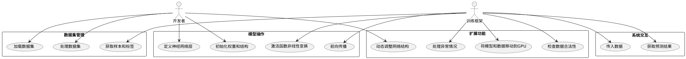

# 源码阅读报告（一）：主要功能分析与建模
## 0>什么是pytorch
wiki百科上对此有描述：PyTorch 是一个基于 Torch 库的机器学习库，用于计算机视觉和自然语言处理等应用，最初由 Meta AI 开发，现在是 Linux 基金会的一部分。 它是与 TensorFlow 并列的两个最受欢迎的深度学习库之一，提供根据修改后的 BSD 许可证发布的免费开源软件。尽管 Python 接口更加精致并且是开发的主要焦点，但 PyTorch 也有 C++ 接口。

### PyTorch 的主要特点
1. **动态计算图**：PyTorch 使用动态计算图（Dynamic Computational Graph），这意味着计算图在运行时是动态构建的。这使得调试和开发更加灵活和直观。
2. **强大的 GPU 加速**：PyTorch 支持 GPU 加速，能够利用 CUDA 和 ROCm 后端进行高效的数值计算。
3. **丰富的库和工具**：PyTorch 提供了丰富的库和工具，如 torchvision（用于计算机视觉）、torchtext（用于自然语言处理）和 torchaudio（用于音频处理）。
4. **社区和生态系统**：PyTorch 拥有一个活跃的社区和广泛的生态系统，提供了大量的教程、示例和预训练模型。
5. **与其他工具的集成**：PyTorch 可以与其他深度学习和机器学习工具（如 TensorBoard、ONNX）无缝集成，方便模型的可视化和部署。

### PyTorch 的应用领域
1. **计算机视觉**：如图像分类、目标检测、图像生成等。
2. **自然语言处理**：如文本分类、机器翻译、文本生成等。
3. **强化学习**：如策略优化、价值函数估计等。
4. **生成对抗网络（GANs）**：用于生成逼真的图像、视频和音频。
5. **时间序列分析**：如预测、异常检测等。

### PyTorch 的基本组件
1. **张量（Tensor）**：PyTorch 的核心数据结构，类似于 NumPy 的 ndarray，但可以在 GPU 上进行加速计算。
2. **自动微分（Autograd）**：PyTorch 提供了自动微分功能，能够自动计算梯度，方便实现反向传播算法。
3. **神经网络模块（torch.nn）**：提供了构建神经网络的基础模块和层，如全连接层、卷积层、循环层等。
4. **优化器（torch.optim）**：提供了常用的优化算法，如 SGD、Adam、RMSprop 等。
5. **数据加载和预处理（torch.utils.data）**：提供了数据加载和预处理的工具，如 DataLoader、Dataset 等。
### PyTorch 示例代码
在这里给出一个简单的例子,笔者将展示pytorch的具体使用
首先引用torch包
```python
import torch
```
我们将创建一个 3x3 的张量，来进行后面的使用，
```python

tensor = torch.rand(3, 3)
print("Original Tensor:")
print(tensor)
```
我们对这个变量做张量加法
```python
tensor_add = tensor + tensor
print("\nTensor after addition:")
print(tensor_add)
```
接下来是乘法
```python

tensor_mul = tensor * tensor
print("\nTensor after multiplication:")
print(tensor_mul)
```
运行这个代码，得到：


综上，我们可以得出结论:PyTorch 是一个灵活且强大的深度学习框架，支持动态计算图和 GPU 加速，广泛应用于计算机视觉、自然语言处理等领域

## 1>主要功能分析与建模
使用在线绘制UML图的平台，绘制pytorch的UML图如下：

### 1.0>一个典型的pytorch类
在这里，我们将给出一个典型的 PyTorch 类的示例，该类实现了一个简单的神经网络模型，并使用 DataLoader 加载数据集进行训练和评估。
这里给出了一个自定义的数据集类 CustomDataset 和一个简单的神经网络模型 SimpleNN。CustomDataset 类用于加载数据集，SimpleNN 类用于定义神经网络模型。
```python
class CustomDataset(Dataset):
    def __init__(self, data, labels):
        self.data = data
        self.labels = labels
    
    def __len__(self):
        return len(self.data)
    
    def __getitem__(self, idx):
        sample = self.data[idx]
        label = self.labels[idx]
        return sample, label

class SimpleNN(nn.Module):
    def __init__(self, input_size, hidden_size, output_size):
        super(SimpleNN, self).__init__()
        self.fc1 = nn.Linear(input_size, hidden_size)
        self.relu = nn.ReLU()
        self.fc2 = nn.Linear(hidden_size, output_size)
    
    def forward(self, x):
        out = self.fc1(x)
        out = self.relu(out)
        out = self.fc2(out)
        return out
```
### 1.1>需求建模
需求模型如下：
```
1.1.1> 系统功能：
这段代码的核心需求是定义自定义数据集和神经网络模型，以便进行机器学习任务。核心功能包括：

自定义数据集加载与索引访问
神经网络的前向传播定义
1.1.2> 角色与需求
角色：
开发者：需要灵活地定义数据集和模型，以便用于不同的机器学习任务。
模型训练框架（如 PyTorch）：需要从数据集中提取样本，并在前向传播时调用神经网络。
主要需求：
需求1：开发者能够自定义数据集，以便处理不同格式的数据源。
需求2：开发者能够定义一个简单的神经网络，以适应特定的输入输出需求。
需求3：训练框架能够通过数据索引从数据集中获取样本，并输入到神经网络进行训练和预测。
1.1.3> 用例分析
用例名称：加载自定义数据集
场景：
Who：开发者，torch.utils.data.DataLoader
Where：内存中保存的数据集对象
When：训练开始时，或者需要从数据集中获取样本时
描述：开发者通过 CustomDataset 类将数据和标签传入，然后通过数据加载器 DataLoader 进行批量加载。训练过程中，框架会根据索引从数据集中提取样本和标签。
用例名称：神经网络前向传播
场景：
Who：开发者，训练框架
Where：模型内部的各层网络，输入和输出之间
When：当输入张量传入模型时（训练或推理阶段）
描述：开发者定义了一个神经网络 SimpleNN，框架在训练和推理阶段会将输入数据传入该网络，按前向传播流程依次通过各层，最终得到预测结果。
1.1.4>类模型
我们可以将代码中定义的类映射为系统中的实体，列出它们的属性和方法：

CustomDataset：

属性：data, labels
方法：__len__(), __getitem__(idx)
SimpleNN：

属性：fc1, relu, fc2
方法：forward(x)
1.1.5> 交互模型
在系统中，CustomDataset 和 SimpleNN 类通过训练框架进行交互：

DataLoader 会调用 CustomDataset 的 __getitem__ 方法来获取训练样本。
训练框架将样本传递给 SimpleNN 进行前向传播，调用 forward 方法得到输出。
1.1.6> 需求模型总结
自定义数据加载：系统允许开发者根据特定需求加载并索引数据集（需求1）。
网络结构灵活定义：系统支持开发者定义前馈神经网络，并可以根据任务灵活设定输入、隐藏层和输出大小（需求2）。
数据与模型的交互：数据集与神经网络通过 PyTorch 的 DataLoader 和 forward 方法进行交互，实现批量数据训练（需求3）。
```
[限制与缺陷]：
    -1：数据如果没有经过逻辑增强，需要进行额外的预处理，才能使用。
    -2：神经网络是静态的，无法根据集体任务调整网络层数。
    -3:使用上述代码进行训练的时候，没有纠错机制，发生错误，就会直接导致训练失败。

综合上述代码，简答归纳可以得到一个功能表格，展示如下：

| 功能分类         | 动词    | 功能描述                                   |
|------------------|---------|--------------------------------------------|
| **数据集相关功能** | 加载    | 从内存中加载数据集                         |
|                  | 处理    | 对数据集进行预处理（尚未实现）              |
|                  | 索引    | 通过索引获取样本及其标签                    |
| **模型相关功能**  | 定义    | 定义神经网络层                             |
|                  | 初始化  | 初始化神经网络的权重和结构                  |
|                  | 激活    | 通过激活函数（ReLU）进行非线性变换           |
|                  | 前向传播 | 计算输入数据通过网络的输出结果              |
| **系统交互功能**  | 传入    | 将数据输入模型                             |
|                  | 获取    | 通过索引获取样本和标签，供模型使用          |
|                  | 返回    | 返回模型的预测结果                         |
| **限制相关功能**  | 调整    | 动态调整网络结构（如层数、神经元数量）       |
|                  | 检查    | 检查输入输出数据的尺寸和合法性               |
|                  | 处理    | 处理错误或异常情况（如数据超出索引范围等）   |
|                  | 移动    | 将数据和模型移动到GPU加速设备               |

提取其中的关键词，我们初步挑选出其中的名词数据集相关功能：
### 1.2>提取关键词，画出对应的UML图

| 类别           | 关键词                       |
|----------------|------------------------------|
| 数据集相关功能 | 内存, 数据集, 预处理, 样本, 标签, 索引 |
| 模型相关功能   | 神经网络, 权重, 结构, 激活函数, 非线性变换, 输入数据, 输出结果 |
| 系统交互功能   | 传入, 获取, 返回             |
| 限制相关功能   | 调整, 检查, 处理, 移动       |

得到的UML图如下：


在这个节点，已经创建一个 pytorch涉及的simpleNN与CustomDataset主要类，这些类已经能初步完成神经网络的训练，我们只需要调用pytorch的包就可以快速实现我们想要的神经网络，利用我们的数据集来训练。不得不说，项目在屏蔽底层细节、提升用户体验上做的确实十分到位。让人可以专注于神经网络的实现，而不必深入具体的代码实现。

### 1.3>实际执行和具体细节探究。
由于pytorch代码实在过于庞杂和笔者水平原因，我们仅在这里以点带面，找到一个更加简单的样例来探究pytorch如何实现细节封装，达到”高内聚，低耦合“的效果。
```python
import torch
a = torch.rand(5)
b = a + a
print(b)
```
这段代码随机生成一个长度为五的一维张量，然后加倍，打印出来。很容易理解。
我们可以在site-packages下查看torch包包含的内容：
对比下方源码的torch目录:

可以发现torch的wheel包安装的内容基本上就是torch目录下的python内容。而c++内容（csrc目录）并没有被复制过来，而是以编译好的动态库文件（_C.cpython-*.so）代替。
在torch目录下的__init__.py文件中，可以看到将_C(动态库)导入的地方:


简单来说：在pytorch中： PyTorch 的 Python 接口，它为用户提供了一组用于构建、训练和评估深度学习模型的工具。前端接口使用 Python 编写，因此可以轻松与其他 Python 库集成（如numpy等）。看到这里我们初步理解，pytorch代码编写时`import torch`的意思。

同时，pytorch为了性能也使用了很多C++的API，这主要是出于性能考虑，python的性能是没有C/C++出色的。这一部分其实也可以正常的C++API接口使用，在使用PyTorch C++时，只需要将项目动态库与头文件正确链接即可。PyTorch官方提供了一个libtorch项目编译cmake例子：
```C++
cmake_minimum_required(VERSION 3.0 FATAL_ERROR)
project(dcgan)

find_package(Torch REQUIRED)

add_executable(dcgan dcgan.cpp)
target_link_libraries(dcgan "${TORCH_LIBRARIES}")
set_property(TARGET dcgan PROPERTY CXX_STANDARD 14)
```
这里的find_package(Torch)这句是通过TorchConfig.cmake实现的库与头文件的链接，这是PyTorch提供的cmake文件，可以让我们快速实现c++项目编译。

torch的c++ API使用和python有一定区别，但在“形式”上大致相似，例如求tensor加法：
```C
#include <torch/torch.h>
#include <iostream>

int main() {
  torch::Tensor a = torch::rand(10);
  auto b = a.add(a);
  std::cout << b << std::endl;
  return 0;
}
```

那么接下来的问题就自然而然是：怎么将这两部分能够“丝滑合作”，达到我们想要的效果。
下面是PyTorch中的Tensor实现，我们可以看到它继承了_C中的_TensorBase

在_C目录下__init__.pyi中，我们可以看到TensorBase的类。.pyi文件是存根文件(stub file)，表示公共接口。其中有各种成员函数的定义，但是没有具体的实现。

在文件的注释中，我们可以看到其具体实现是在python_variable.cpp中。

在python_variable.cpp文件中，我们可以看到PyTorch实际是用了pybind，将c++和Python进行交互的.


我们这里以Tensor.dtype为例，它的实现在THPVariable_properties中。

找到这个结构体的实现，可以看到dtype具体绑定了THPVariable_dtype()这个函数。因此在Python中执行tensor.dtype时，实际运行的就是这个c++函数。


PyTorch主要是python API与C++ API，在设计上采用Pythonic式的编程风格，可以让用户像使用python一样使用PyTorch，其对外也提供的C++接口，也可以一定程度上实现PyTorch的大部分功能。主要是通过pybind调用c++实现，具体是c++被编译成_C.[***].so动态库，然后python调用torch._C实现调用c++中的函数。
### 1.4>依赖分析
最后，我们再通过 DSM 图来对 torch.nn 模块进行依赖分析，如下页图:
