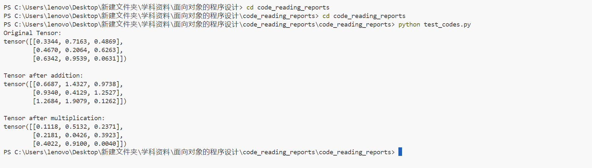
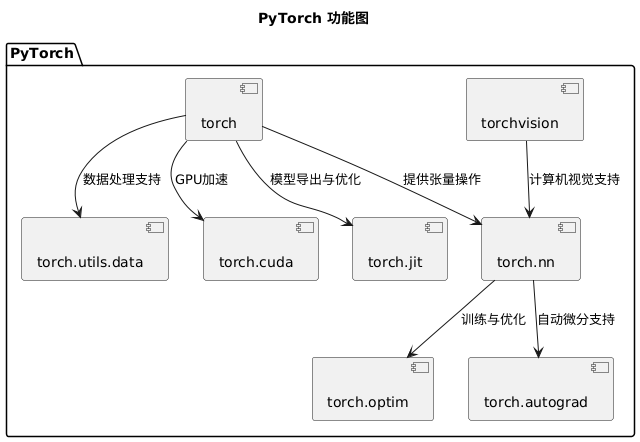

# 源码阅读报告（一）：主要功能分析与建模
## 0>什么是pytorch
wiki百科上对此有描述：PyTorch 是一个基于 Torch 库的机器学习库，用于计算机视觉和自然语言处理等应用，最初由 Meta AI 开发，现在是 Linux 基金会的一部分。 它是与 TensorFlow 并列的两个最受欢迎的深度学习库之一，提供根据修改后的 BSD 许可证发布的免费开源软件。尽管 Python 接口更加精致并且是开发的主要焦点，但 PyTorch 也有 C++ 接口。

### PyTorch 的主要特点
1. **动态计算图**：PyTorch 使用动态计算图（Dynamic Computational Graph），这意味着计算图在运行时是动态构建的。这使得调试和开发更加灵活和直观。
2. **强大的 GPU 加速**：PyTorch 支持 GPU 加速，能够利用 CUDA 和 ROCm 后端进行高效的数值计算。
3. **丰富的库和工具**：PyTorch 提供了丰富的库和工具，如 torchvision（用于计算机视觉）、torchtext（用于自然语言处理）和 torchaudio（用于音频处理）。
4. **社区和生态系统**：PyTorch 拥有一个活跃的社区和广泛的生态系统，提供了大量的教程、示例和预训练模型。
5. **与其他工具的集成**：PyTorch 可以与其他深度学习和机器学习工具（如 TensorBoard、ONNX）无缝集成，方便模型的可视化和部署。

### PyTorch 的应用领域
1. **计算机视觉**：如图像分类、目标检测、图像生成等。
2. **自然语言处理**：如文本分类、机器翻译、文本生成等。
3. **强化学习**：如策略优化、价值函数估计等。
4. **生成对抗网络（GANs）**：用于生成逼真的图像、视频和音频。
5. **时间序列分析**：如预测、异常检测等。

### PyTorch 的基本组件
1. **张量（Tensor）**：PyTorch 的核心数据结构，类似于 NumPy 的 ndarray，但可以在 GPU 上进行加速计算。
2. **自动微分（Autograd）**：PyTorch 提供了自动微分功能，能够自动计算梯度，方便实现反向传播算法。
3. **神经网络模块（torch.nn）**：提供了构建神经网络的基础模块和层，如全连接层、卷积层、循环层等。
4. **优化器（torch.optim）**：提供了常用的优化算法，如 SGD、Adam、RMSprop 等。
5. **数据加载和预处理（torch.utils.data）**：提供了数据加载和预处理的工具，如 DataLoader、Dataset 等。
### PyTorch 示例代码
在这里给出一个简单的例子,笔者将展示pytorch的具体使用
首先引用torch包
```python
import torch
```
我们将创建一个 3x3 的张量，来进行后面的使用，
```python

tensor = torch.rand(3, 3)
print("Original Tensor:")
print(tensor)
```
我们对这个变量做张量加法
```python
tensor_add = tensor + tensor
print("\nTensor after addition:")
print(tensor_add)
```
接下来是乘法
```python

tensor_mul = tensor * tensor
print("\nTensor after multiplication:")
print(tensor_mul)
```
运行这个代码，得到：


综上，我们可以得出结论:PyTorch 是一个灵活且强大的深度学习框架，支持动态计算图和 GPU 加速，广泛应用于计算机视觉、自然语言处理等领域

## 1>主要功能分析与建模
使用在线绘制UML图的平台，绘制pytorch的UML图如下：

### 1.1>需求建模
我们第零部分给出了一个代码示例与输出结果，现在我们将分析这些代码将如何做到这一点。
