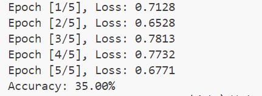

# 源码阅读报告（一）：主要功能分析与建模
## 0>什么是pytorch
wiki百科上对此有描述：PyTorch 是一个基于 Torch 库的机器学习库，用于计算机视觉和自然语言处理等应用，最初由 Meta AI 开发，现在是 Linux 基金会的一部分。 它是与 TensorFlow 并列的两个最受欢迎的深度学习库之一，提供根据修改后的 BSD 许可证发布的免费开源软件。尽管 Python 接口更加精致并且是开发的主要焦点，但 PyTorch 也有 C++ 接口。

### PyTorch 的主要特点
1. **动态计算图**：PyTorch 使用动态计算图（Dynamic Computational Graph），这意味着计算图在运行时是动态构建的。这使得调试和开发更加灵活和直观。
2. **强大的 GPU 加速**：PyTorch 支持 GPU 加速，能够利用 CUDA 和 ROCm 后端进行高效的数值计算。
3. **丰富的库和工具**：PyTorch 提供了丰富的库和工具，如 torchvision（用于计算机视觉）、torchtext（用于自然语言处理）和 torchaudio（用于音频处理）。
4. **社区和生态系统**：PyTorch 拥有一个活跃的社区和广泛的生态系统，提供了大量的教程、示例和预训练模型。
5. **与其他工具的集成**：PyTorch 可以与其他深度学习和机器学习工具（如 TensorBoard、ONNX）无缝集成，方便模型的可视化和部署。

### PyTorch 的应用领域
1. **计算机视觉**：如图像分类、目标检测、图像生成等。
2. **自然语言处理**：如文本分类、机器翻译、文本生成等。
3. **强化学习**：如策略优化、价值函数估计等。
4. **生成对抗网络（GANs）**：用于生成逼真的图像、视频和音频。
5. **时间序列分析**：如预测、异常检测等。

### PyTorch 的基本组件
1. **张量（Tensor）**：PyTorch 的核心数据结构，类似于 NumPy 的 ndarray，但可以在 GPU 上进行加速计算。
2. **自动微分（Autograd）**：PyTorch 提供了自动微分功能，能够自动计算梯度，方便实现反向传播算法。
3. **神经网络模块（torch.nn）**：提供了构建神经网络的基础模块和层，如全连接层、卷积层、循环层等。
4. **优化器（torch.optim）**：提供了常用的优化算法，如 SGD、Adam、RMSprop 等。
5. **数据加载和预处理（torch.utils.data）**：提供了数据加载和预处理的工具，如 DataLoader、Dataset 等。
### PyTorch 示例代码
在这里给出一个简单的例子,笔者将展示pytorch的具体使用
首先引用torch包
```python
import torch
```
我们将创建一个 3x3 的张量，来进行后面的使用，
```python

tensor = torch.rand(3, 3)
print("Original Tensor:")
print(tensor)
```
我们对这个变量做张量加法
```python
tensor_add = tensor + tensor
print("\nTensor after addition:")
print(tensor_add)
```
接下来是乘法
```python

tensor_mul = tensor * tensor
print("\nTensor after multiplication:")
print(tensor_mul)
```
运行这个代码，得到：


综上，我们可以得出结论:PyTorch 是一个灵活且强大的深度学习框架，支持动态计算图和 GPU 加速，广泛应用于计算机视觉、自然语言处理等领域

## 1>主要功能分析与建模
使用在线绘制UML图的平台，绘制pytorch的UML图如下：

### 1.0>一个典型的pytorch类
在这里，我们将给出一个典型的 PyTorch 类的示例，该类实现了一个简单的神经网络模型，并使用 DataLoader 加载数据集进行训练和评估。
这里给出了一个自定义的数据集类 CustomDataset 和一个简单的神经网络模型 SimpleNN。CustomDataset 类用于加载数据集，SimpleNN 类用于定义神经网络模型。
```python
class CustomDataset(Dataset):
    def __init__(self, data, labels):
        self.data = data
        self.labels = labels
    
    def __len__(self):
        return len(self.data)
    
    def __getitem__(self, idx):
        sample = self.data[idx]
        label = self.labels[idx]
        return sample, label

class SimpleNN(nn.Module):
    def __init__(self, input_size, hidden_size, output_size):
        super(SimpleNN, self).__init__()
        self.fc1 = nn.Linear(input_size, hidden_size)
        self.relu = nn.ReLU()
        self.fc2 = nn.Linear(hidden_size, output_size)
    
    def forward(self, x):
        out = self.fc1(x)
        out = self.relu(out)
        out = self.fc2(out)
        return out
```
### 1.1>需求建模
我们第零部分给出了一个代码示例与输出结果，现在我们将分析这些代码将如何做到这一点。

```python
import torch
import torch.nn as nn
import torch.optim as optim
from torch.utils.data import DataLoader, TensorDataset

# 1. 定义模型
class SimpleNN(nn.Module):
    def __init__(self, input_size, hidden_size, output_size):
        super(SimpleNN, self).__init__()
        self.fc1 = nn.Linear(input_size, hidden_size)
        self.relu = nn.ReLU()
        self.fc2 = nn.Linear(hidden_size, output_size)
    
    def forward(self, x):
        out = self.fc1(x)
        out = self.relu(out)
        out = self.fc2(out)
        return out

# 2. 创建数据集
# 假设我们有一些训练数据和标签
train_data = torch.randn(100, 10)  # 100个样本，每个样本10个特征
train_labels = torch.randint(0, 2, (100,))  # 100个样本的标签，二分类问题

# 创建DataLoader
train_dataset = TensorDataset(train_data, train_labels)
train_loader = DataLoader(train_dataset, batch_size=10, shuffle=True)

# 3. 初始化模型、损失函数和优化器
input_size = 10
hidden_size = 5
output_size = 2
model = SimpleNN(input_size, hidden_size, output_size)

criterion = nn.CrossEntropyLoss()
optimizer = optim.SGD(model.parameters(), lr=0.01)

# 4. 训练模型
num_epochs = 5
for epoch in range(num_epochs):
    for data, labels in train_loader:
        # 前向传播
        outputs = model(data)
        loss = criterion(outputs, labels)
        
        # 反向传播和优化
        optimizer.zero_grad()
        loss.backward()
        optimizer.step()
    
    print(f'Epoch [{epoch+1}/{num_epochs}], Loss: {loss.item():.4f}')

# 5. 评估模型
# 假设我们有一些测试数据和标签
test_data = torch.randn(20, 10)
test_labels = torch.randint(0, 2, (20,))

# 前向传播
with torch.no_grad():
    test_outputs = model(test_data)
    _, predicted = torch.max(test_outputs.data, 1)
    accuracy = (predicted == test_labels).sum().item() / test_labels.size(0)

print(f'Accuracy: {accuracy * 100:.2f}%')
```
运行这段代码之后可以看到结果如下：。当然这部分代码结果准确率不高，这是因为我们的数据集是随机生成的，可以预料到结果的不准确